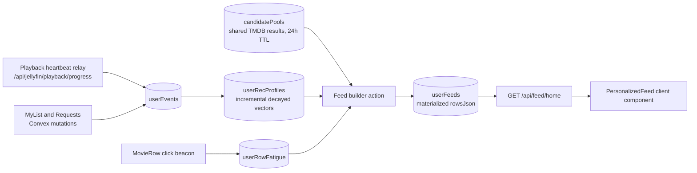

# UmrFlix Personalization Engine — v1 Spec (Household Scale)

> **Implementation:** build from `PERSONALIZATION_IMPLEMENTATION.md` (phase-by-phase, self-contained, migration-aware). 
> **Authoritative deltas from this spec:** the 64-D vector format is retained (already built with bounded cost); UCB1 leaves the serve path (offline stats stay); feed/pool/feed caching is in-process (single PM2 process) instead of Convex-materialized tables; `rowImpressionStats` doubles as the offline `rowEngagement` table. — v1 Spec (Household Scale)

**Status:** Fully Implemented (Phases 0–5 complete)
**Supersedes:** the full-scale discovery-engine draft. Roughly 30% of that scope survived; everything cut (with reasons) is in §11.
**Targets:** home `/` (client-hydrated personalized feed) and `/genre/[slug]` (item re-ranking). `/movie` and `/tvshows` come into scope in Phase 3 via the shared row pipeline (section 5.5).

## 0. Design Constraints — read first; they drive every decision

| Reality (verified against the repo) | Consequence for the design |
|---|---|
| Household scale: ~5–10 users | Population-level bandits and CTR stats are noise. Exploration is deterministic rotation, not UCB1. |
| Home page is a shared ISR shell: `revalidate = 3600` in `src/app/page.tsx`, with `generateRecommendations("default")` baked in — identical for every user | Personalization cannot live in the shell. Personalized rows hydrate client-side (the existing `ContinueWatchingSection` pattern) from `/api/feed/home`. |
| One TMDB API key, one server IP (~40–50 req/s) | Candidate pools are fetched once and shared across all users. Per-user work is *ranking only*, never fetching. |
| Convex limits: 1 MiB/doc, 32k docs scanned, 16 MiB read, ~1 s user-code per transaction; `cacheStore` rows are deleted after 7 days by `convex/crons.ts` | Feeds are materialized ahead of time; vectors live in a dedicated `itemFeatures` table as typed arrays — never in `cacheStore`, never as JSON strings. |
| Auth = one Jellyfin session cookie; no profile system exists (`src/lib/auth.ts`) | Everything is keyed by `userId`. There is no `profileId`. |
| TMDB list payloads carry only `genre_ids`, dates, votes, popularity | 30-D vectors from free fields. Keyword/credit dimensions (which would need 2N extra detail calls per rebuild) are cut. |

## 1. Architecture



**Read path is O(1):** one indexed document get per user. All compute is asynchronous (Convex scheduled actions, 6h cron + event triggers). The ISR home shell is untouched.

## 2. Module 1 — Signal Ingestion

**Sources (all exist today except the click beacon):**
- `POST /api/jellyfin/playback/progress` — the existing heartbeat relay (`start | progress | stopped`). Recommendation events are emitted on `stopped` only. The stream-info route `playback/[id]` stays untouched.
- `convex/myList.ts` add/remove → favorite events.
- `convex/requests.ts` insert → request event (+1.00 — the strongest signal this app uniquely owns; TMDB can't see it).
- `MovieRow` poster click → `POST /api/feed/click` beacon (one fire-and-forget call; drives fatigue, not the profile).

**Weight matrix (all weights within [-1, 1]; formulas fixed from the review):**

| Event | w(a) | Trigger |
|---|---|---|
| Complete | +1.00 | `stopped` with p = position / runtime ≥ 0.90 |
| Partial | `0.10 + 0.70·p` — evaluates to [0.17, 0.72] | `stopped` with p ∈ [0.10, 0.89] |
| Abandon | −0.40 | `stopped` before 180 s **and** p ≤ 0.05 |
| Re-watch | +0.80 | a complete/partial on an item with a prior event ≤ 30 days old |
| Favorite / Unfavorite | +1.00 / −0.60 | myList add / remove |
| Request | +1.00 | row inserted into `requests` |
| Rating | (R−3)/2 | reserved; only if a rating UI ever ships |

Notes:
- The partial-playback cliff (0.72 → 1.00 at 90%) is deliberate: finishing is meaningfully different from sampling.
- Re-watch is a flat in-range constant (the old log formula overflowed the [-1, 1] invariant at every realistic Δt).

**Rules:**
- `userId` comes from the session cookie server-side — never from the client payload. Timestamps are server receipt time. `p` is clamped to [0, 1]; durations are sanity-clamped to runtime.
- Episode events roll up to the parent series: `itemKey = "tv:{seriesTmdbId}"`; movies use `"movie:{tmdbId}"`. No per-episode vectors.
- Events fired while the player is in `?party=` mode log `context: "party"` and apply at ×0.25 — group viewing is not individual taste.
- Write budget: ≤ ~2 events per minute per user at peak. No batching needed at household scale.

## 3. Module 2 — Profile Vectors (30-D, incremental)

**Layout** — every dimension comes from fields present in TMDB list payloads; the item vector is L2-normalized once at write time:

- **dims 0–19 — genres** (TMDB genre union, ≤ 20). An item with k genres gets mass 1/k on each.
- **dims 20–27 — decade bucket**, soft-encoded: 0.8 on the item's decade, 0.1 on each neighbor (kills hard boundary cliffs between e.g. 2009 and 2010).
- **dims 28–29 — format**: movie / series.

Because all blocks are non-negative and roughly balanced in mass, plain cosine over the concatenated vector is well-behaved. (The old spec mixed one-hot blocks with unbounded TF-IDF hash blocks, which silently turned cosine similarity into a genre detector.)

**Dual temporal profile with O(1) incremental updates** — no event re-scanning, ever:

- Two running sums: `short` (half-life 7 days) and `long` (half-life 90 days), each stored with its own `lastUpdatedAt`.
- On event at time t: `U ← U · 2^(−(t − lastUpdated) / halfLife) + w(a) · V_i`.
- On read: decay to "now" first, then use.
- Composite: `U = 0.6 · normalize(short) + 0.4 · normalize(long)`. Guards: norm < 1e-6 → treat that side as zero and use the other alone; both zero → cold start. α is fixed at 0.6 — the old 48-hour flip created a feed discontinuity at the boundary.
- The first 3 events per profile are weighted ×3 (fast adaptation window); `eventCount` lives on the profile.
- `vectorVersion` is stored on both profiles and item vectors; a mismatch zeroes and rebuilds the profile (prevents silent meaning-drift of stored vectors).

**Cold start:** uniform 1/20 mass across genre dims → Sim is ~constant for all items → Tier-1 ranking degenerates gracefully to quality/popularity ordering. Exactly the right behavior for a new user, and no population-average corpus to maintain.

## 4. Module 3 — Rows

| Row | Source | Row key |
|---|---|---|
| Continue Watching, Recently Added | existing components, untouched | pinned — exempt from ranking and fatigue |
| Top Picks For You | Tier-1 ranking over the union of all candidate pools | `top_picks` |
| Because You Watched {title} (≤ 2 per feed) | top positive seeds from the last 30 days of events; candidates via the existing `getTmdbRecommendations` helper (TMDB `/recommendations`); watched items excluded | `byw:{itemKey}` |
| Facet rows | fixed catalog of ~14 templates (genre × decade, genre × genre, format × genre), each mapped to a TMDB discover query | hash of the discover params — stable forever |
| Exploration slot (exactly 1) | the facet template least recently served to this user, read from `userRowFatigue.lastServedAt` | same hashing |
| Late Night Thrillers (optional) | client passes its local hour to `/api/feed/home`; if hour ∈ [22, 3], a thriller/horror/mystery facet is inserted at slot 4 | `facet:late_night` |

Facet titles are plain template strings: `"{Genre} Movies"`, `"{Genre} from the {Decade}"`, `"{Genre} & {Genre2}"`. No clustering, no learned title compiler.

**Candidate pools — the scaling trick.** Each facet/BYW/top-picks pool is fetched from TMDB once, stored in a shared `candidatePools` doc (24 h TTL), and reused by every user. Per-user work is scoring and ordering. Each discover query pulls up to 3 pages (60 items) into the pool, and rows sample 20 scored items out of 60 - depth is what kills the 'limited pool' feel (see section 5.5). TMDB call volume is constant in the number of users. A row needs ≥ 8 items or it is dropped — no parent-cluster merging; pools are TMDB-wide, so rows rarely starve.

## 5. Module 4 — Ranking

**Tier 1 — items (weights are defined this time):**

`S_item = 0.50·Sim + 0.20·Quality + 0.15·Pop + 0.15·Recency`

- `Sim` = cosine(U, V_i) ∈ [0, 1] (non-negative vectors).
- `Quality` = `vote_average / 10`; if `vote_count < 50`, use 0.5 (neutral — avoids dampening new releases).
- `Pop` = `min(1, ln(1 + popularity) / ln(101))`.
- `Recency` = `exp(−max(0, currentYear − year) / 5)`.

- `ServeDemotion` = `0.85^serves` for items already served to this user within 72 h (`userServeLog`); applied multiplicatively after scoring. Repetition decays instead of cliff-edges, so pools cannot starve.

Hard filters *before* scoring (replacing the old penalty arithmetic): fully-watched items (except when the row is "Because You Watched" re-engagement), missing poster, unreleased. Watched-set = completes from `userEvents` within the 90-day retention window — anything older may resurface, which at this scale reads as a "watch it again" nudge rather than a bug.

**Tier 2 — rows:**

`S_row = mean(S_top3) · (0.5 + 0.5·Relevance) · Fatigue`

- `Relevance` = cosine(U, centroid of the row's top-5 item vectors).
- `Fatigue` = `0.75^K` where K = consecutive serves without a click. A click resets K to 0. K ≥ 4 suppresses the row for 7 days.
- **MMR** greedy selection with μ = 0.7, `Overlap(A,B) = |A∩B| / min(|A|,|B|)`.
- **Feed floor:** never fewer than 6 personalized rows. If suppression drops below the floor, un-suppress oldest suppressions first. Utility rows always render.

Impressions are *serves*: when `/api/feed/home` is fetched, the served row keys are logged in one batched mutation. Clicks come from the MovieRow beacon. No IntersectionObserver, no viewport tracking, no dwell timers.

## 5.5. Cross-Surface Repetition (why every page shows the same posters today)

Root causes, verified in the current code:
1. **Different pages run the same queries.** Home "Global Hits" is `/api/tmdb/trending/movie/week`; the movie page's "Popular Movies" calls the identical endpoint. The movie page's "Popular {X} Movies" (`discover/movie?with_genres=X&sort_by=popularity.desc`) and the genre page's "Trending in {X}" are near-identical queries. Three surfaces serve the same ~40 heads of the popularity distribution.
2. **Rows are one page deep.** Every row fetches page 1 (20 items) of the same two sort orders (popularity, vote_average), whose heads overlap massively.
3. **No cross-surface memory.** Nothing stops an item served on home from being re-served on `/movie` ten minutes later; only `genre-catalog.ts` dedupes, and only within a single page render.

Fixes (extensions of machinery from sections 4-8, not a new subsystem):
- **Deeper pools (above):** up to 3 pages per discover query.
- **One shared row pipeline everywhere:** filter watched -> score `S_item` -> cross-row dedupe -> truncate. The materialized home feed, `genre-catalog.ts`, and the new `/api/feed/row` route (backing `/movie` and `/tvshows`) all consume it, so an item can appear at most once per page.
- **Cross-surface serve memory:** `userServeLog` (section 8) remembers what each user was served; the pipeline demotes repeats (section 5) instead of blindly re-serving them.
- **Static duplicates retired:** `/movie` and `/tvshows` swap their raw `/api/tmdb/*` endpoints for `/api/feed/row?facet=...`, which returns pooled, watched-filtered, `S_item`-ordered items in the same response shape as the existing discover proxies - `MovieRow` needs no changes.

## 6. Module 5 — Materialization & Triggers

Feed rebuilds happen on three triggers only:
1. **6-hour cron** (extend `convex/crons.ts`) — rebuild feeds for users active in the last 7 days.
2. **Event-triggered** — a complete, favorite, or request schedules a rebuild, debounced 5 minutes.
3. **On-demand miss** — if a user's `userFeeds` doc is absent or older than 24 h, the API serves curated fallback rows immediately and schedules a rebuild.

The `userFeeds` doc holds the fully ordered layout: `[{ rowKey, title, subtitle, items[≤20] }]`, plus `generatedAt`. Reading it is one indexed get.

**Fallback rule:** if Convex is unreachable or the build fails, the client renders the existing static category rows (the current `DYNAMIC_CATEGORY_POOL` behavior extracted into a shared constant, `src/lib/static-rows.ts`). The homepage is never empty — matching the current page's graceful degradation when Jellyfin is down.

## 7. Module 6 — Edge Cases & Safety

- **New user:** cold-start vector (§3) + curated rows until 3 events land.
- **Parental ratings:** movie candidate pools attach `certification_country=US&certification.lte={maxParentalRating}` from the session (a free discover parameter). TMDB's TV discover has **no** certification filter; restricted sessions must show movie rows only until TV-side gating is built. Do not silently ship TV rows to a restricted session.
- **Shared screens:** `excludedFromRecs: string[]` is reserved on the profile now; Because-You-Watched seed selection honors it when populated. The UI toggle ("private mode") lands when there is an actual UI for it — the schema is future-proofed.
- **Retention:** daily cron deletes `userEvents` older than 90 days (fold into the existing `crons.ts` pattern). Relatedly: this is why nothing personal may ever live in `cacheStore` — it is already purged on a 7-day cycle.
- **Auth on ingest:** every new mutation derives `userId` server-side from the session, clamps numeric inputs, and rate-limits the click beacon to 1/s per user. No client-supplied timestamps anywhere in the pipeline.

## 8. Convex Schema

```ts
userEvents: defineTable({
  userId: v.string(),
  itemKey: v.string(),               // "movie:{tmdbId}" | "tv:{tmdbId}"
  mediaType: v.string(),
  eventType: v.string(),             // "complete" | "partial" | "abandon" | "rewatch" | "favorite" | "unfavorite" | "request"
  weight: v.number(),                // pre-computed w(a), clamped [-1, 1]
  context: v.optional(v.string()),   // "party" | undefined
  timestamp: v.number(),             // server receipt time
})
  .index("by_user_time", ["userId", "timestamp"]),

itemFeatures: defineTable({
  itemKey: v.string(),
  vector: v.array(v.float64()),      // 30-D, L2-normalized
  year: v.number(),
  popularity: v.number(),
  voteAverage: v.number(),
  voteCount: v.number(),
  vectorVersion: v.number(),
  updatedAt: v.number(),
}).index("by_itemKey", ["itemKey"]),

userRecProfiles: defineTable({
  userId: v.string(),
  shortVector: v.array(v.float64()),
  longVector: v.array(v.float64()),
  shortUpdatedAt: v.number(),
  longUpdatedAt: v.number(),
  eventCount: v.number(),
  vectorVersion: v.number(),
  excludedFromRecs: v.optional(v.array(v.string())),
}).index("by_user", ["userId"]),

candidatePools: defineTable({
  poolKey: v.string(),               // hash of the discover params
  itemsJson: v.string(),             // raw TMDB items + per-item vectors
  fetchedAt: v.number(),
}).index("by_pool", ["poolKey"]),

userFeeds: defineTable({
  userId: v.string(),
  rowsJson: v.string(),
  generatedAt: v.number(),
}).index("by_user", ["userId"]),

userRowFatigue: defineTable({
  userId: v.string(),
  rowKey: v.string(),
  unclickedServes: v.number(),
  lastServedAt: v.number(),
  suppressedUntil: v.number(),
}).index("by_user_row", ["userId", "rowKey"]),

userServeLog: defineTable({
  userId: v.string(),
  servesJson: v.string(),            // itemKey -> { count, lastServedAt }; pruned to 7 days on write
  updatedAt: v.number(),
}).index("by_user", ["userId"]),

rowEngagement: defineTable({
  rowKey: v.string(),
  date: v.string(),                  // YYYY-MM-DD
  impressions: v.number(),
  clicks: v.number(),
}).index("by_row_date", ["rowKey", "date"]),
// Offline tuning only — never read at serve time.
```

Dropped from the old schema: `rowImpressionStats` (bandit state — the bandit is gone), JSON-encoded vector strings (typed arrays instead — no parse cost on read, indexable), and anything stored in `cacheStore`.

## 9. API Surface

| Route | Purpose |
|---|---|
| `GET /api/feed/home?hour=` | returns `userFeeds.rowsJson` (or curated fallback); logs served row keys + `rowEngagement` in one batched mutation |
| `POST /api/feed/click` | `{ rowKey, itemKey }` beacon; session-authed, rate-limited 1/s; resets fatigue K for `rowKey` |
| `GET /api/feed/row?facet=` | Drop-in replacement for raw `/api/tmdb/*` row endpoints on `/movie` and `/tvshows`: one pooled, watched-filtered, `S_item`-ordered row; same response shape as the discover proxies |
| `convex/recs.ts` (new) | `recordEvent`, `buildFeed` (internal action), profile get/patch helpers |
| Existing, reused | `api/jellyfin/playback/progress` (event emission), `convex/myList.ts`, `convex/requests.ts`, `getTmdbRecommendations` |

## 10. Integration Matrix (corrected)

| Component | File | Action |
|---|---|---|
| Playback signals | `src/app/api/jellyfin/playback/progress/route.ts` — the heartbeat relay. **Not** `playback/[id]`, which is a load-time info GET that fires before any watching happens | emit `userEvents` on `stopped` |
| Favorites | `convex/myList.ts` | log favorite/unfavorite inline at mutation |
| Requests | `convex/requests.ts` | log +1.00 on insert |
| Profile math + feed builder | `convex/recs.ts` (new) | recordEvent, incremental vector updates, buildFeed action |
| Home page | `src/app/page.tsx` | keep the ISR shell (hero, trending, spotlights, static rows, Recently Added); replace the SSR `forYouItems`/`becauseYouWatchedSeed` blocks with a `<PersonalizedFeed />` client component (SWR on `/api/feed/home`, same pattern as `ContinueWatchingSection`). Delete `generateRecommendations("default")` from the shell — it currently renders identical picks for every user |
| MovieRow | `src/components/MovieRow.tsx` | add click beacon (one optional prop + `navigator.sendBeacon`) |
| Genre pages | `src/lib/genre-catalog.ts` | after existing row assembly, re-order `row.items` by `S_item` using the caller's profile (pages are already `force-dynamic` with `userId`). rewire `top-picks`/`because` rows from the legacy `hasEnoughSignals` profile onto `convex/recs.ts`; route static rows (trending, acclaimed, decade, etc.) through the shared pipeline (watched filter -> `S_item` -> dedupe). The existing `pushRow` seen-set dedupe stays as the final pass |
| `/movie`, `/tvshows` | `src/app/movie/page.tsx`, `src/app/tvshows/page.tsx` (P3) | swap static `/api/tmdb/*` endpoints for `/api/feed/row?facet=...` backed by `candidatePools` + shared pipeline; removes the identical trending/popularity heads these pages currently share with home |
| Old engine | `src/lib/recommendations.ts` | keep `toRowItem`, `dedupeByTmdbId`, `getTmdbRecommendations`; retire the static `generateRecommendations` scoring |
| Fallback rows | extract `DYNAMIC_CATEGORY_POOL` into `src/lib/static-rows.ts` | shared by the ISR shell and the client-side fallback |

## 11. Explicitly Out of Scope (the dropped ~70%)

| Dropped | Why |
|---|---|
| UCB1 bandit, global `rowImpressionStats` | ~10 users = statistically meaningless CTRs; position bias uncorrectable. Rotation + fatigue gets the same discovery effect for 5% of the machinery |
| K-medoids/agglomerative clustering + rule-based title compiler | No k-selection rule, unstable row identities every re-cluster (which breaks fatigue keys and any stats keyed on them), O(n²·d) inside a serverless budget. Facet templates + TMDB discover do the same job deterministically |
| Dimensions 32–63 (credits/keywords TF-IDF) | Requires 2N TMDB detail calls per candidate rebuild; no bulk endpoint exists. Revisit only if P4 shows genre+decade+format is too coarse |
| IntersectionObserver impressions, dwell time, scroll-pass events | An entire client instrumentation layer for marginal signal. Serves + clicks cover fatigue |
| Learned time-slot boost / historical peak windows | Requires stats infrastructure nobody maintains; the client-hour Late Night row covers the intent |
| `profileId` multi-user household profiles | No profile system exists in auth (`src/lib/auth.ts`). Re-add when profiles do |
| Watch velocity, device-based rows, ANN search, position-bias-corrected CTR | Scale-inappropriate for a household deployment |

## 12. Rollout Phases

| Phase | Scope | Acceptance |
|---|---|---|
| P0 — Signals (~1–2 d) | schema deploy; event emission in progress route; click beacon in MovieRow; retention cron | events land in `userEvents`; player behavior unchanged; `npm run lint` + `npm run build` clean |
| P1 — Materialized feed (~2–3 d) | profile math; feed builder action; `/api/feed/home`; `<PersonalizedFeed />` swap on `/` | cold user gets curated rows; two users get visibly different Top Picks; home shell TTFB unchanged (ISR untouched) |
| P2 — Diversity & freshness (~1–2 d) | MMR; fatigue counters; 7-day suppression; feed floor; exploration rotation | no two rows overlap > 0.5; suppression/expiry verified end-to-end; floor holds when everything is suppressed |
| P3 — All browse surfaces (~2 d) | genre-catalog rewiring onto the shared pipeline; `/movie` + `/tvshows` via `/api/feed/row`; facet pools up to 60 items; client-hour Late Night row | same item never appears twice on one page; surfaces no longer share identical row heads; rows order differently per user; Late Night only appears 22:00–03:00 local |
| P4 — Evaluation (2 weeks live) | read `rowEngagement`; tune §13 constants | written decision per constant: keep, tune, or re-introduce one §11 item — with data |

## 13. Constants — every magic number in one place

| Constant | Value | Where used |
|---|---|---|
| α (short-term blend) | 0.6 | profile composite |
| Half-lives | 7 d / 90 d | short/long vectors |
| Tier-1 weights | 0.50 / 0.20 / 0.15 / 0.15 | Sim / Quality / Pop / Recency |
| Fatigue γ / suppression | 0.75 / K ≥ 4 → 7 days | Tier 2 |
| MMR μ | 0.7 | Tier 2 |
| Neutral-quality threshold | vote_count < 50 → 0.5 | Tier 1 |
| Pool TTL / rebuild cadence | 24 h / 6 h cron | candidatePools / crons |
| Pool depth | up to 3 pages (60 items) per discover query | candidatePools |
| Cross-surface serve demotion | x0.85 per serve within 72 h | userServeLog -> Tier 1 |
| Trigger debounce | 5 min | event-triggered rebuild |
| Row size / min items | ≤ 20 / ≥ 8 | feed builder |
| Feed floor | 6 rows | Tier 2 |
| Event retention | 90 days | retention cron |
| Fast-adaptation | first 3 events ×3 | profile |
| Party-context dampener | ×0.25 | ingestion |
| Re-watch window | 30 days | ingestion |
| Abandon threshold | < 180 s and p ≤ 0.05 | ingestion |

Every value in this table is a starting guess. P4 exists to change them with data — which is why `rowEngagement` is logged from day one but never read at serve time.