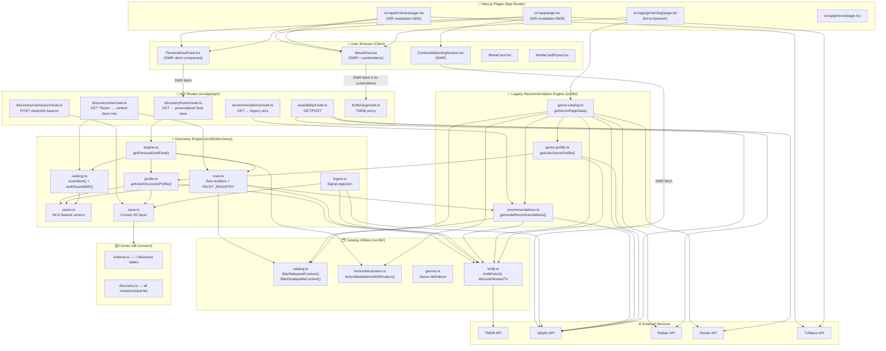
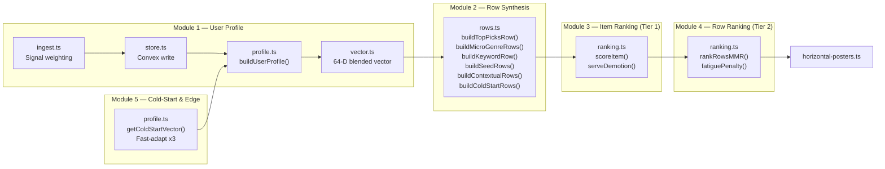
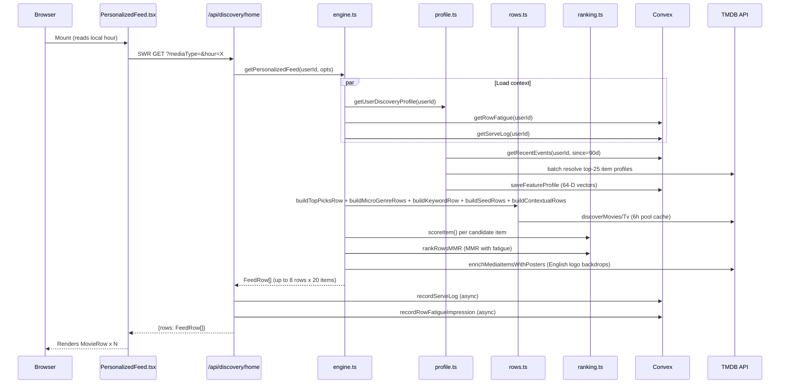
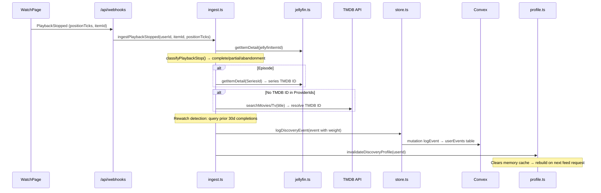
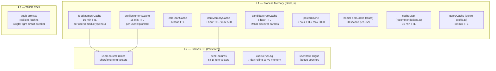

# UmrFlix — Catalog & Personalized Recommendation System Architecture

> Every file, data flow, and subsystem involved in showing a user their catalog — personalized or not.

---

## System Overview



---

## Layer 1 — Pages & Entry Points

| File | Type | Role |
|---|---|---|
| [`src/app/page.tsx`](file:///G:/umiflox/UmrFlix/src/app/page.tsx) | Server Component (ISR 1h) | Home shell: TMDB trending + Jellyfin recently-added + TVMaze airing labels server-side. Renders `<PersonalizedFeed />` client-side for per-user rows. |
| [`src/app/tvshows/page.tsx`](file:///G:/umiflox/UmrFlix/src/app/tvshows/page.tsx) | Server Component (ISR 30m) | TV catalog: hero, genre filter, trending/airing rows. Embeds `<PersonalizedFeed mediaType="tv" />`. |
| [`src/app/movie/page.tsx`](file:///G:/umiflox/UmrFlix/src/app/movie/page.tsx) | Server Component | Movie catalog page. |
| [`src/app/genre/[slug]/page.tsx`](file:///G:/umiflox/UmrFlix/src/app/genre/%5Bslug%5D/page.tsx) | Server Component (force-dynamic) | Dedicated genre page. Calls `getGenrePageData(slug, userId)` — richest personalization surface with 10+ curated rows. |
| [`src/app/popular/page.tsx`](file:///G:/umiflox/UmrFlix/src/app/popular/page.tsx) | Server Component | Popular catalog page. |

---

## Layer 2 — UI Components (src/components/)

| File | Role |
|---|---|
| [`PersonalizedFeed.tsx`](file:///G:/umiflox/UmrFlix/src/components/PersonalizedFeed.tsx) | SWR-fetches `/api/discovery/home?mediaType=&hour=`. Renders `MovieRow` per row. Passes local hour for contextual triggers. Intersperses `<ContinueWatchingSection>` at row 2. |
| [`MovieRow.tsx`](file:///G:/umiflox/UmrFlix/src/components/MovieRow.tsx) | Horizontally scrollable card row. Accepts `endpoint` (SWR) or `customItems`. Runs `filterDisplayableContent()` client-side. Batch-fetches availability badges + English horizontal posters. Fires impression/click beacons. |
| [`ContinueWatchingSection.tsx`](file:///G:/umiflox/UmrFlix/src/components/ContinueWatchingSection.tsx) | SWR-fetches Jellyfin in-progress items. Dedicated scroll row with progress bars. |
| [`MovieCard.tsx`](file:///G:/umiflox/UmrFlix/src/components/MovieCard.tsx) | Single card tile: poster, title, availability badge. |
| [`MediaCardFlyout.tsx`](file:///G:/umiflox/UmrFlix/src/components/MediaCardFlyout.tsx) | Hover/tap flyout: detail, Play, Add to List, Request, Trailer. |
| [`HeroBillboard.tsx`](file:///G:/umiflox/UmrFlix/src/components/HeroBillboard.tsx) | Fullscreen hero carousel (ISR trending data). |
| [`SpotlightBanner.tsx`](file:///G:/umiflox/UmrFlix/src/components/SpotlightBanner.tsx) | Mid-page featured banner interleaved between rows. |
| [`GenreSwitcher.tsx`](file:///G:/umiflox/UmrFlix/src/components/GenreSwitcher.tsx) | Horizontal genre pill selector on genre pages. |
| [`TopGenreSelector.tsx`](file:///G:/umiflox/UmrFlix/src/components/TopGenreSelector.tsx) | Genre filter bar on TV Shows page. |
| [`GenreFilterBar.tsx`](file:///G:/umiflox/UmrFlix/src/components/GenreFilterBar.tsx) | Pill filter bar for genre selection. |

---

## Layer 3 — API Routes (src/app/api/)

### Discovery Endpoints

| Route | Method | Purpose |
|---|---|---|
| [`/api/discovery/home`](file:///G:/umiflox/UmrFlix/src/app/api/discovery/home/route.ts) | GET | Main personalized feed. Calls `getPersonalizedFeed()`. Returns up to 8 ranked rows. Records serve log + row fatigue impressions. 20s per-user cache. |
| [`/api/discovery/row`](file:///G:/umiflox/UmrFlix/src/app/api/discovery/row/route.ts) | GET `?facet=` | Personally-ranked single facet row for `/movie`, `/tvshows`. Loads FACET_REGISTRY pool → scores items → serve demotion. |
| [`/api/discovery/impression`](file:///G:/umiflox/UmrFlix/src/app/api/discovery/impression/route.ts) | POST | Row feedback beacon. `view` → increment fatigue. `click` → reset fatigue + UCB1 click. |

### Other Catalog Endpoints

| Route | Method | Purpose |
|---|---|---|
| [`/api/recommendations`](file:///G:/umiflox/UmrFlix/src/app/api/recommendations/route.ts) | GET | Legacy rec endpoint (foryou / itemId / generic). Wraps `generateRecommendations()`. |
| [`/api/availability`](file:///G:/umiflox/UmrFlix/src/app/api/availability/route.ts) | GET + POST | Batch availability check: cross-references Radarr/Sonarr/Jellyfin/requests. Returns status badges shown on cards. |
| `/api/tmdb/[...slug]` | GET | TMDB API proxy. Used by `MovieRow` for trending/discover rows when no `customItems`. |

---

## Layer 4A — Discovery Engine (src/lib/discovery/)



### [`src/lib/discovery/vector.ts`](file:///G:/umiflox/UmrFlix/src/lib/discovery/vector.ts) — 64-D Feature Vectors

| Dims | Feature Group | Encoding |
|---|---|---|
| 0–19 | Genres (20 TMDB categories) | One-hot, primary genre weight=1.0, others=0.7 |
| 20–27 | Release decade (8 buckets: Classic/70s/80s/90s/00s/10s/20s/Latest) | Gaussian soft-encoding (σ=4 years) |
| 28–31 | Runtime buckets (<30m / 30–60m / 60–120m / >120m) | Hard bucket |
| 32–47 | Top-8 cast + directors | FNV-1a hash % 16, billing-order decay 1/(1+order) |
| 48–63 | Top-20 TMDB plot keywords | FNV-1a hash % 16, weight 0.9 |

Key constants: `SHORT_TERM_HALF_LIFE_DAYS=7`, `LONG_TERM_HALF_LIFE_DAYS=90`, blend `α=0.6`

### [`src/lib/discovery/ingest.ts`](file:///G:/umiflox/UmrFlix/src/lib/discovery/ingest.ts) — Signal Weighting Matrix

| Event | Weight | Trigger |
|---|---|---|
| `play_complete` (≥90%) | +1.00 | `ingestPlaybackStopped()` |
| `partial_play` (10–89%) | +0.10 to +0.80 | `ingestPlaybackStopped()` |
| `abandonment` (≤5%, ≤3min) | −0.40 | `ingestPlaybackStopped()` |
| `rewatch` (2nd completion ≤30d) | +0.80 | Auto-detected |
| `favorite` | +1.00 | `ingestFavoriteToggle()` |
| `unfavorite` | −0.60 | `ingestFavoriteToggle()` |
| `request` | +1.00 | `ingestRequestCreated()` |
| Party context | ×0.25 multiplier | `context="party"` |
| Fast-adapt (first 3 events) | ×3.0 multiplier | `FAST_ADAPT_EVENT_COUNT=3` |

### [`src/lib/discovery/profile.ts`](file:///G:/umiflox/UmrFlix/src/lib/discovery/profile.ts) — User Discovery Profile

- **`getUserDiscoveryProfile(userId, profileId)`** — Main entry. 15-min memory cache + `SingleFlight` dedup.
- **`buildUserProfile()`** — Reads 90-day events from Convex, resolves top-25 item profiles (batched 5 at a time from TMDB), accumulates short+long term vectors with temporal decay. Extracts:
  - `completedKeys` — items ≥90% watched (hidden from rows)
  - `interactedKeys` — any positively-signalled items
  - `seedCandidates` — top 5 high-signal items for "Because You Watched" rows
  - `topGenreDims` — top 2 dominant genre dimensions from blended vector
  - `topDecadeBucket` — strongest era preference
  - `topKeywords` — top 10 TMDB keywords by blended weight
  - `peakViewingHour` — from hourHistogram of play events
  - `meanWatchMinutes` — for "Bite-Sized" contextual row trigger
- **Cold-start** — Averages vectors across weekly TMDB trending (6h TTL)
- **Persistence** — Saves short/long vectors to Convex `userFeatureProfiles` after each build

### [`src/lib/discovery/rows.ts`](file:///G:/umiflox/UmrFlix/src/lib/discovery/rows.ts) — Row Builders

| Builder | Row Key | Fires When | Source |
|---|---|---|---|
| `buildTopPicksRow()` | `"top-picks"` | Always | TMDB trending + top genre dim discover |
| `buildMicroGenreRows()` | `"micro-genre:{dim}:{decade}"` | `hasProfile` | TMDB discover by top 2 genre dims + decade bucket. Small-library fallback to parent genre. |
| `buildKeywordRow()` | `"keyword:{id}"` | `hasProfile + topKeywords` | TMDB discover `with_keywords=` + top genre |
| `buildSeedRows()` | `"byw:{type}:{tmdbId}"` | Up to 2 seed candidates | TMDB `/movie|tv/{id}/recommendations` |
| `buildContextualRows()` | `"context:late-night"` | hour ≥22 or <3 | TMDB discover genres 53+27 (Thriller+Horror) |
| `buildContextualRows()` | `"context:bite-sized"` | `meanWatchMinutes < 35` | TMDB discover runtime ≤35m |
| `buildColdStartRows()` | `"cold:trending-*"` etc. | No profile / fallback | TMDB trending + acclaimed + action |

**FACET_REGISTRY** — 14 static facets used by `/api/discovery/row`:

```
Movies: recently-released-movies, popular-movies, top-rated-movies,
        action-adventure-movies, sci-fi-fantasy-movies, comedy-movies, horror-thriller-movies
TV:     on-the-air-shows, popular-shows, top-rated-shows,
        sci-fi-fantasy-shows, crime-mystery-shows, comedy-shows, animation-shows
```

Candidate pool cache: **6-hour TTL** per parameter set.

### [`src/lib/discovery/ranking.ts`](file:///G:/umiflox/UmrFlix/src/lib/discovery/ranking.ts) — Two-Tier Ranking

**Tier 1 — Item Score:**
```
S_item = 0.50 × CosineSim(user_vec, item_vec)
       + 0.20 × Quality  [vote_avg/10, min 0.5 if vote_count < 50]
       + 0.15 × ln-normalized Popularity
       + 0.15 × Recency  [exp(-age_years/5)]
       × serveDemotion   [0.85^serves, if served within 72h]
```

**Tier 2 — MMR Row Ranking:**
```
S_row    = topItemScore × relevance × fatiguePenalty(0.75^unclickedImpressions)
next_row = argmax [ 0.7×S_row − 0.3×max_overlap(row, selected) ]
```

Row suppression: ≥4 unclicked impressions in 7 days → row hidden.

### [`src/lib/discovery/store.ts`](file:///G:/umiflox/UmrFlix/src/lib/discovery/store.ts) — Convex Persistence Layer

All Convex I/O. Falls back to in-memory buffer (2000 events) when Convex is offline.

| Function | Convex Table | Direction |
|---|---|---|
| `logDiscoveryEvent()` | `userEvents` | write |
| `getRecentDiscoveryEvents()` | `userEvents` | read |
| `saveFeatureProfile()` | `userFeatureProfiles` | write |
| `loadFeatureProfile()` | `userFeatureProfiles` | read |
| `recordRowImpression()` | `rowImpressionStats` | write |
| `recordRowFatigueImpression()` | `userRowFatigue` | write |
| `resetRowFatigue()` | `userRowFatigue` | write |
| `getRowFatigueMap()` | `userRowFatigue` | read |
| `getCachedItemProfile()` | `itemFeatures` | read |
| `setCachedItemProfile()` | `itemFeatures` | write |
| `getServeLog()` | `userServeLog` | read |
| `recordServeLog()` | `userServeLog` | write |

### [`src/lib/discovery/engine.ts`](file:///G:/umiflox/UmrFlix/src/lib/discovery/engine.ts) — Feed Orchestrator

`getPersonalizedFeed(userId, profileId, {mediaType, maxRows=8, clientHour})`:
1. Check 10-min memory cache (`feedMemoryCache`)
2. Load profile + fatigue map + serve log in parallel
3. Build candidate rows (profile-aware or cold-start path)
4. **Tier 1:** Score items per row; apply serve demotion; filter completed/interacted
5. Feed floor guarantee: ensure ≥6 rows even if some suppressed by fatigue
6. **Tier 2:** MMR row ranking → up to `maxRows`
7. Pin `"top-picks"` at position 0
8. Cross-row deduplication via global `seenItems` Set
9. Enrich backdrops with English horizontal posters (TMDB `/images`)
10. Cache + return `FeedRow[]`

---

## Layer 4B — Legacy Recommendation Engine (src/lib/)

| File | Key Functions | Purpose |
|---|---|---|
| [`recommendations.ts`](file:///G:/umiflox/UmrFlix/src/lib/recommendations.ts) | `generateRecommendations()` `getForYouRecommendations()` `getBecauseYouWatchedRecommendations()` `getTmdbRecommendations()` `getGenreRecommendations()` | Fetches Jellyfin resume history → parallelizes TMDB item recommendations + trending → scores with weighted formula (rating 40%, popularity 30%, source 20%, recency 10%). 30-min memory cache. |
| [`genre-catalog.ts`](file:///G:/umiflox/UmrFlix/src/lib/genre-catalog.ts) | `getGenrePageData()` | Builds full genre page: trending, top-picks, acclaimed, new/recent, hidden gems, "Because You Watched", decade rows, availability-aware rows. 30-min TTL + SingleFlight. |
| [`genre-profile.ts`](file:///G:/umiflox/UmrFlix/src/lib/genre-profile.ts) | `getUserGenreProfile()` `getGenreTopPicks()` `getBecauseYouWatched()` | Per-user genre affinity from Jellyfin resume + My List + favorites. Taps Discovery Engine's `getUserDiscoveryProfile()` for cosine affinity scoring. |

---

## Layer 5 — Catalog Filter Utilities (src/lib/)

| File | Functions | Role |
|---|---|---|
| [`catalog.ts`](file:///G:/umiflox/UmrFlix/src/lib/catalog.ts) | `filterReleasedContent()` `filterDisplayableContent()` `isQualityContent()` `isOnlyInCinemas()` | **Universal content gate** applied at every stage. Strips: announced/in-production, future releases, 30-day theatrical window, vote_avg<3.5 (≥5 votes), runtime<15m, obscure titles (voteCount<10 AND popularity<1.0). `filterDisplayableContent` also requires poster + overview. |
| [`horizontal-posters.ts`](file:///G:/umiflox/UmrFlix/src/lib/horizontal-posters.ts) | `enrichMediaItemsWithPosters()` `fetchEnglishHorizontalPoster()` | Fetches highest-voted English title-treated backdrop from TMDB `/images`, replaces `backdrop_path`. 1h memory cache up to 5000 entries. |
| [`genres.ts`](file:///G:/umiflox/UmrFlix/src/lib/genres.ts) | `getGenreBySlug()` `getGenreByParam()` `getGenreDiscoverParams()` `buildGenreDiscoverQuery()` | Genre registry: name, slug, TMDB movie IDs, TMDB TV IDs, discover param presets. |

---

## Layer 6 — Convex Database (convex/)

### [`convex/schema.ts`](file:///G:/umiflox/UmrFlix/convex/schema.ts) — Discovery Tables

| Table | Purpose |
|---|---|
| `userEvents` | Immutable signal log (eventType, weight, completionPct, watchDurationSec, timestamp). Indexed by `[userId, profileId]` and `[timestamp]`. |
| `userFeatureProfiles` | Persisted 64-D short+long vectors as JSON. Recovery after process restart. |
| `rowImpressionStats` | Global UCB1 bandit stats per row category (totalImpressions, totalClicks, totalPlays). |
| `userRowFatigue` | Per-user unclicked impression counters + lastSeenTimestamp. Indexed by `[userId, profileId, rowCategoryKey]`. |
| `itemFeatures` | Cached 64-D item vectors + scoring metadata by `itemKey="movie:550"`. |
| `userServeLog` | Cross-surface serve memory: `{itemKey: {count, lastServedAt}}` JSON blob. 7-day rolling window. |
| `myList` | User's saved watchlist (tmdbId, mediaType, title, posterPath). |

### [`convex/discovery.ts`](file:///G:/umiflox/UmrFlix/convex/discovery.ts) — All Functions

15 mutations/queries covering: logEvent, getRecentEvents, pruneOldEvents, saveFeatureProfile, getFeatureProfile, recordRowImpression, getRowStats, recordRowFatigueImpression, resetRowFatigue, getRowFatigue, getItemFeature, setItemFeature, getServeLog, recordServeLog.

---

## Layer 7 — External Services

| Library | Service | Catalog Role |
|---|---|---|
| [`src/lib/tmdb.ts`](file:///G:/umiflox/UmrFlix/src/lib/tmdb.ts) | TMDB API | `getTrending()`, `discoverMovies()`, `discoverTv()`, `tmdbFetch()`, `getItemLogo()`, `searchMovies()`, `searchTv()`. Primary catalog source. |
| [`src/lib/jellyfin.ts`](file:///G:/umiflox/UmrFlix/src/lib/jellyfin.ts) | Jellyfin | `getResumeItems()` (signals), `getAllItems()` (library index), `getUserFavorites()`, `getItemDetail()` (TMDB ID resolution). |
| [`src/lib/radarr.ts`](file:///G:/umiflox/UmrFlix/src/lib/radarr.ts) | Radarr | `getMovies()`, `getQueue()`. Movie download status badges. |
| [`src/lib/sonarr.ts`](file:///G:/umiflox/UmrFlix/src/lib/sonarr.ts) | Sonarr | `getSeries()`, `getQueue()`. TV download status badges. |
| [`src/lib/tvmaze.ts`](file:///G:/umiflox/UmrFlix/src/lib/tvmaze.ts) | TVMaze | `lookupShowByTvdbId()`, `getNextEpisode()`, `getAiringLabel()`. Airing labels on homepage/TV page. |

---

## End-to-End: Personalized Home Feed



---

## End-to-End: Signal Ingestion (Playback Stop)



---

## Caching Architecture



---

## Complete File Inventory

### Discovery Engine — `src/lib/discovery/`
- [`engine.ts`](file:///G:/umiflox/UmrFlix/src/lib/discovery/engine.ts) — Feed orchestrator, 2-tier ranking, 10-min cache
- [`profile.ts`](file:///G:/umiflox/UmrFlix/src/lib/discovery/profile.ts) — 64-D user vector construction, cold-start, fast-adapt
- [`rows.ts`](file:///G:/umiflox/UmrFlix/src/lib/discovery/rows.ts) — 6 row builders + 14-entry FACET_REGISTRY + 6h pool cache
- [`ranking.ts`](file:///G:/umiflox/UmrFlix/src/lib/discovery/ranking.ts) — `scoreItem()`, `serveDemotion()`, `rankRowsMMR()`, `fatiguePenalty()`
- [`vector.ts`](file:///G:/umiflox/UmrFlix/src/lib/discovery/vector.ts) — 64-D feature space, cosine similarity, temporal decay, blend
- [`ingest.ts`](file:///G:/umiflox/UmrFlix/src/lib/discovery/ingest.ts) — Signal weighting, playback classification, rewatch detection
- [`store.ts`](file:///G:/umiflox/UmrFlix/src/lib/discovery/store.ts) — Convex I/O wrapper + 2000-event in-memory fallback buffer

### Catalog Logic — `src/lib/`
- [`catalog.ts`](file:///G:/umiflox/UmrFlix/src/lib/catalog.ts) — Universal content quality/release filter
- [`recommendations.ts`](file:///G:/umiflox/UmrFlix/src/lib/recommendations.ts) — Legacy engine (watch history → similar → trending → score)
- [`genre-catalog.ts`](file:///G:/umiflox/UmrFlix/src/lib/genre-catalog.ts) — Genre page row builder (10+ row types, 30-min cache)
- [`genre-profile.ts`](file:///G:/umiflox/UmrFlix/src/lib/genre-profile.ts) — Genre affinity from Jellyfin signals
- [`horizontal-posters.ts`](file:///G:/umiflox/UmrFlix/src/lib/horizontal-posters.ts) — English logo backdrop enrichment (1h cache)
- [`genres.ts`](file:///G:/umiflox/UmrFlix/src/lib/genres.ts) — Genre registry + TMDB ID mappings
- [`tmdb.ts`](file:///G:/umiflox/UmrFlix/src/lib/tmdb.ts) — TMDB API client
- [`jellyfin.ts`](file:///G:/umiflox/UmrFlix/src/lib/jellyfin.ts) — Jellyfin API client
- [`radarr.ts`](file:///G:/umiflox/UmrFlix/src/lib/radarr.ts) — Radarr API client
- [`sonarr.ts`](file:///G:/umiflox/UmrFlix/src/lib/sonarr.ts) — Sonarr API client
- [`tvmaze.ts`](file:///G:/umiflox/UmrFlix/src/lib/tvmaze.ts) — TVMaze API client
- [`cache.ts`](file:///G:/umiflox/UmrFlix/src/lib/cache.ts) — Jellyfin/Radarr/Sonarr index caches + Convex L2 cache
- [`circuit-breaker.ts`](file:///G:/umiflox/UmrFlix/src/lib/circuit-breaker.ts) — `SingleFlight` dedup for concurrent profile builds
- [`use-availability.ts`](file:///G:/umiflox/UmrFlix/src/lib/use-availability.ts) — `useBatchAvailability` SWR hook
- [`use-horizontal-posters.ts`](file:///G:/umiflox/UmrFlix/src/lib/use-horizontal-posters.ts) — `useBatchHorizontalPosters` SWR hook

### API Routes — `src/app/api/`
- [`discovery/home/route.ts`](file:///G:/umiflox/UmrFlix/src/app/api/discovery/home/route.ts)
- [`discovery/row/route.ts`](file:///G:/umiflox/UmrFlix/src/app/api/discovery/row/route.ts)
- [`discovery/impression/route.ts`](file:///G:/umiflox/UmrFlix/src/app/api/discovery/impression/route.ts)
- [`recommendations/route.ts`](file:///G:/umiflox/UmrFlix/src/app/api/recommendations/route.ts)
- [`availability/route.ts`](file:///G:/umiflox/UmrFlix/src/app/api/availability/route.ts)

### Pages — `src/app/`
- [`page.tsx`](file:///G:/umiflox/UmrFlix/src/app/page.tsx) — Home (ISR 1h)
- [`tvshows/page.tsx`](file:///G:/umiflox/UmrFlix/src/app/tvshows/page.tsx) — TV Shows (ISR 30m)
- [`movie/page.tsx`](file:///G:/umiflox/UmrFlix/src/app/movie/page.tsx) — Movie catalog
- [`genre/[slug]/page.tsx`](file:///G:/umiflox/UmrFlix/src/app/genre/%5Bslug%5D/page.tsx) — Genre page (force-dynamic)

### UI Components — `src/components/`
- [`PersonalizedFeed.tsx`](file:///G:/umiflox/UmrFlix/src/components/PersonalizedFeed.tsx)
- [`MovieRow.tsx`](file:///G:/umiflox/UmrFlix/src/components/MovieRow.tsx)
- [`ContinueWatchingSection.tsx`](file:///G:/umiflox/UmrFlix/src/components/ContinueWatchingSection.tsx)
- [`MovieCard.tsx`](file:///G:/umiflox/UmrFlix/src/components/MovieCard.tsx)
- [`MediaCardFlyout.tsx`](file:///G:/umiflox/UmrFlix/src/components/MediaCardFlyout.tsx)
- [`HeroBillboard.tsx`](file:///G:/umiflox/UmrFlix/src/components/HeroBillboard.tsx)
- [`SpotlightBanner.tsx`](file:///G:/umiflox/UmrFlix/src/components/SpotlightBanner.tsx)
- [`GenreSwitcher.tsx`](file:///G:/umiflox/UmrFlix/src/components/GenreSwitcher.tsx)
- [`TopGenreSelector.tsx`](file:///G:/umiflox/UmrFlix/src/components/TopGenreSelector.tsx)
- [`GenreFilterBar.tsx`](file:///G:/umiflox/UmrFlix/src/components/GenreFilterBar.tsx)

### Convex Backend — `convex/`
- [`schema.ts`](file:///G:/umiflox/UmrFlix/convex/schema.ts) — 7 discovery tables + sessions + myList + requests
- [`discovery.ts`](file:///G:/umiflox/UmrFlix/convex/discovery.ts) — 15 mutations/queries
- [`myList.ts`](file:///G:/umiflox/UmrFlix/convex/myList.ts) — My List CRUD
