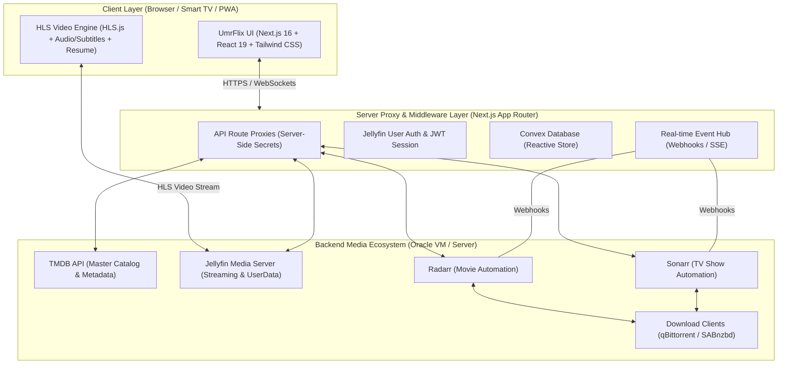

# UmrFlix — Production Roadmap

> **Vision:** Transform UmrFlix from a functional MVP into a production-grade, everyday-usable media web application — combining TMDB's exhaustive catalog, Jellyfin's streaming capabilities, and Radarr/Sonarr's automated media management into a seamless, Netflix-quality experience.

---

## Architecture Overview

---

## 0. MVP Implementation Status (Completed)

The core MVP foundation has been fully built and verified:

- [x] **Scaffold & UI Core:** Next.js 16 (App Router), TypeScript, Tailwind CSS v4, shadcn/ui components (`MovieCard`, `AvailabilityBadge`, `RequestButton`, `RequestModal`, `Navbar`, `SearchBar`, `VideoPlayer`).
- [x] **API Proxy Layer:** Server-side route handlers proxying TMDB (`/trending`, `/search`, `/movie/:id`, `/tv/:id`), Radarr (`/movies`, `/queue`), Sonarr (`/series`, `/queue`), and Jellyfin (`/stream/:id`).
- [x] **Library Cache & ID Cross-Referencing:** In-memory collection caching (`cache.ts`) matching TMDB `tmdbId` for movies and resolving TMDB `external_ids` -> TVDB `tvdbId` for TV shows.
- [x] **Availability Engine:** Live status indicator ("In Library", "Downloading XX%", "Request").
- [x] **Automated Requesting:** Modal workflow for adding movies to Radarr and series to Sonarr.
- [x] **Library Browser & Basic Playback:** `/library` grid with filtering and embedded HTML5 video playback via Jellyfin.

---

## Phase 1: Crunchyroll-Inspired Premium UI/UX (Netflix Red Aesthetic) (Completed)

### 1.1 Header, Navigation & Branding Integration
- [x] **Branded Header Navigation (`Navbar.tsx`):**
  - Integrate custom logo (`logo_header.png`) and custom favicon (`favicon.ico`).
  - Dark sleek top bar (`#141519`) with top accent border in Netflix Red (`#E50914`).
  - Navigation menu links: "Home", "Popular", "Movies", "TV Shows", "Categories", "My Library".
  - Quick Search input box with Netflix red focus line, live search drop-down overlay, and Watchlist quick-access icon.

### 1.2 Crunchyroll-Style Hero Spotlight Carousel
- [x] **Hero Billboard & Carousel (`HeroBillboard.tsx`):**
  - Full-width hero banner slider featuring high-res backdrop fanart with dark side gradient overlays.
  - Show metadata pills (`NEW`, `Sub | Dub`, `Rating`, `Genres`).
  - Action buttons styled after Crunchyroll's high-contrast CTAs: Netflix Red primary "WATCH NOW" button with play icon, and secondary outline "ADD TO WATCHLIST" button.
  - Bottom slider thumbnail navigation indicators.

### 1.3 Media Cards, Continue Watching & Spotlight Banners
- [x] **Crunchyroll Card System (`MovieCard.tsx`, `ContinueWatchingCard.tsx`):**
  - **Portrait Media Cards:** Clean vertical posters with top-corner availability ribbon tag (In Library / Downloading / Request), crisp title underneath, and metadata tag line (`Sub | Dub`, `Year`, `Availability`).
  - **Continue Watching Landscape Cards (`ContinueWatchingRow.tsx`):** 16:9 widescreen thumbnails with bottom red progress bar, episode/time remaining badge (e.g., `23m left` or `62% downloaded`).
  - **Middle Spotlight Banners (`SpotlightBanner.tsx`):** Crunchyroll-style mid-page featured highlight cards split between large backdrop image on left and title, description, and Netflix Red action buttons on right.

### 1.4 Crunchyroll-Style Categorized Search & Grid
- [x] **Search Results Page (`/search` & `SearchResults.tsx`):**
  - Instant query bar with red focus line.
  - Categorized results layout: "Top Results" hero cards, "Series" grid list, and "Movies" grid list with episode/season metadata badges.

### 1.5 Crunchyroll Dark Theme System (`globals.css`)
- [x] **Color Palette & Styling:**
  - Deep dark background (`#141519` / `#0a0b0d`), subtle card elevation (`#23252b`).
  - Primary Brand Accent: Netflix Red (`#E50914`) replacing Crunchyroll orange for all buttons, active indicators, progress bars, and focus states.
  - Footer with logo, category directory, resources, and social links.

---

## Phase 2: Production Video Player & Media Engine (Completed)

### 2.1 HLS.js & Transcoding Media Engine
- [x] **Advanced Video Player (`CinemaPlayer.tsx`):**
  - Integrate `hls.js` for adaptive HLS streaming (resolves browser codec incompatibility with MKV/HEVC/EAC3/DTS).
  - Automatic fallback between Direct Play (native HTML5) and Transcoded HLS stream based on browser capabilities.
  - Quality selector (Auto, 4K 20Mbps, 1080p 10Mbps, 720p 4Mbps) hitting Jellyfin's transcode profile API.

### 2.2 Subtitles & Multi-Audio Selector
- [x] **Track Switcher:**
  - Audio track selector (English 5.1, Commentary, Original Audio language).
  - Subtitle track selector (Embedded Jellyfin SRT/VTT + OpenSubtitles plugin integration).
  - Subtitle styling controls: Font size, background opacity, text color, and sync offset adjustment slider (+/- 5 seconds).

### 2.3 Progress Tracking & "Continue Watching" Sync
- [x] **Bi-directional Jellyfin Playback State:**
  - Send periodic heartbeat events (`POST /Sessions/Playing/Progress`) to Jellyfin every 10 seconds.
  - Save watch progress percentage and playback position timestamp.
  - "Resume Playback" prompt modal ("Resume from 42:15" vs "Start from Beginning").
  - Auto-mark items as "Watched" when reaching 90% completion.

### 2.4 TV Show Episode Navigator & Season Browser
- [x] **TV Show Season Hub (`SeasonBrowser.tsx`):**
  - Season selector dropdown/tab bar with season poster and episode count.
  - Episode card grid featuring episode thumbnail, episode title, air date, runtime, overview, and individual download/play status.
  - "Next Episode" auto-play overlay prompt with 10-second countdown timer during episode credits.

### 2.5 Intro & Credits Skipping
- [x] **Marker Integration:**
  - Support Jellyfin Intro Skipper API / chapter markers.
  - Display "Skip Intro" and "Skip Recap" floating buttons during detected timestamp ranges.

---

## Phase 3: Multi-User Auth, Profiles & Personalization (Completed)

### 3.1 Native Jellyfin Authentication & Session Security
- [x] **User Authentication Flow (`/login`):**
  - Replace static `.env` Jellyfin credentials with a multi-user Jellyfin login interface.
  - Authenticate against Jellyfin server API (`POST /Users/AuthenticateByName`).
  - Store Jellyfin `AccessToken` and `UserId` in encrypted httpOnly HTTP cookies (`iron-session` or JWT).
  - User profile switcher in Navbar (Avatar, username, active server URL).

### 3.2 Role-Based Access Control (RBAC)
- [x] **Permissions & Limits:**
  - Admin users: Full control over Radarr/Sonarr profiles, root folders, download cancellation, and library settings.
  - Standard users: Can browse and request titles (subject to request quotas or approval workflows).
  - Guest/Kids mode: Filter catalog based on Jellyfin rating restrictions.

### 3.3 Personalized Watchlists & Favorites
- [x] **User Personalization:**
  - "My List" bookmark button synced with Jellyfin User Favorites (`POST /Users/{userId}/FavoriteItems/{itemId}`).
  - Watch status indicators (green checkmark for watched, partial progress bar for in-progress).

---

## Phase 4: Admin Dashboard, Request Management & Real-time Automation Hub (Completed)

### 4.1 Admin Request Management Dashboard (`/admin/requests`)
- [x] **Request Approval & Denial Workflow:**
  - Non-admin user requests do NOT automatically dispatch to Radarr/Sonarr; they are placed into a `pending` request queue.
  - Admin users can review pending requests with media poster, title, requester username, quality profile, and destination folder.
  - One-click **Approve** button (dispatches request to Radarr/Sonarr, sets status to `approved`, sends approval notification to user).
  - One-click **Deny** button (opens denial reason prompt, sets status to `denied`, sends denial notification with reason to user).
  - Admin users can submit direct requests or bypass approval.

### 4.2 Integrated qBittorrent & Jellyfin Admin Dashboard (`/admin`)
- [x] **qBittorrent Active Downloads Monitoring:**
  - Integrated qBittorrent Web API client (`/api/v2/torrents/info`).
  - Real-time torrent list displaying release name, progress %, torrent size, download/upload speeds (MB/s), ETA, status, and seeders/leechers ratio.
  - Admin torrent control actions: Pause, Resume, and Delete torrent.
- [x] **Jellyfin Active Sessions Monitoring:**
  - Real-time display of active streaming sessions from Jellyfin API (`GET /Sessions`).
  - Shows active user avatar/name, movie/show title being played, client device, video resolution, Direct Play vs Transcode status, and progress.
  - Admin session action: Terminate stream session (`POST /Sessions/{sessionId}/Stop`).
- [x] **Total Storage & Disk Space Monitor:**
  - Aggregate disk space monitor across qBittorrent download drives and Radarr/Sonarr media root folders (`/api/v3/diskspace`).
  - Visual storage allocation bar showing Used, Free, and Total storage capacity in GB/TB.

### 4.3 User Request Management Dashboard & Notifications (`/requests`)
- [x] **User Request History & Monitoring Page (`/requests`):**
  - Dedicated page for non-admin and admin users to track their requested movies and TV shows.
  - Filter tabs: `All`, `Pending`, `Approved`, `Denied`.
  - Request cards showing poster art, title, media type, request date, status badge, and denial reason if rejected.
- [x] **Real-time Request Status Notification System (`NotificationBell.tsx`):**
  - Instant notification alerts generated when an admin approves or denies a user request.
  - Interactive Notification Bell icon in Navbar with unread badge counter.
  - Slide-over / dropdown notification list with "Mark as read", notification message, timestamp, and quick link to request details.

### 4.4 Advanced Request Customization Modal
- [x] **Enhanced Request Modal (`RequestModal.tsx`):**
  - Quality Profile selector (e.g., Ultra-HD 4K, HD-1080p, Any).
  - Root Folder destination picker (with disk space information).
  - Minimum Availability & Tags selection.
  - For TV Shows: Season selection picker (All Seasons, First Season, Future Seasons, Specific Seasons checkboxes).

### 4.5 Webhook & Server-Sent Events (SSE) System
- [x] **Real-time Event Bridge (`/api/webhooks`):**
  - Configure Radarr & Sonarr Webhooks pointing to UmrFlix (`On Grab`, `On Download`, `On Rename`).
  - Server-Sent Events (SSE) channel (`/api/events`) to broadcast state changes instantly to client browsers.
  - Instant UI badge state updates without polling.

---

## Phase 5: Persistent Cache & High-Performance Architecture

### 5.1 Convex Database Integration
- [ ] **Convex Backend (convex/*):**
  - Replace in-memory maps in `cache.ts` with Convex for persistent, reactive storage.
  - Define Convex schemas for TMDB metadata, TMDB↔TVDB mappings, Jellyfin item indices, and user request history.
  - Use Convex mutations/queries for all CRUD operations, replacing manual cache logic.
  - Leverage Convex scheduled functions (cron jobs) for periodic collection index refreshes.
  - Remove SQLite/Prisma/Redis dependencies in favor of Convex's built-in reactive data layer.

### 5.2 Next.js Image Optimization & Asset Proxying
- [ ] **Optimized Media Delivery:**
  - Use `next/image` for TMDB posters and fanart (`image.tmdb.org`).
  - Secure proxy route for Jellyfin image assets (`/api/jellyfin/image/:id`) with token authorization and browser caching headers.

### 5.3 Resilient API Middleware & Circuit Breakers
- [ ] **Fault Tolerance:**
  - Circuit breaker for external services (Radarr, Sonarr, Jellyfin, TMDB).
  - Fallback UI states when any self-hosted service goes offline (e.g., graceful message "Radarr unavailable, browsing remains active").
  - Retry logic with exponential backoff for external API calls.

---

## Phase 6: PWA, Smart TV Support & Production Deployment

### 6.1 Progressive Web App (PWA) & Smart TV Navigation
- [ ] **Everyday Usability & Accessibility:**
  - PWA Web Manifest (`manifest.json`) and service worker for app installation on mobile and desktop.
  - Spatial Navigation (D-Pad support for TV remotes / LG webOS / Samsung Tizen / Android TV browsers).
  - Touch gestures for mobile video player (double tap to skip 10s, vertical drag for volume/brightness).

### 6.2 Dockerization & Production Infrastructure
- [ ] **Deployment Readiness:**
  - Multi-stage `Dockerfile` optimizing Next.js standalone build output.
  - Complete `docker-compose.yml` boilerplate integrating UmrFlix with Jellyfin, Radarr, Sonarr, and Caddy/Nginx reverse proxy.
  - Environment variable validation using `zod` on app start.
  - Health check endpoint (`GET /api/health`) reporting status of database and upstream media services.

### 6.3 Health Monitoring & Audit Logs
- [ ] **Observability:**
  - Application activity log for admin users (who requested what, download completions, auth logs).
  - Error boundaries with user-friendly recovery UI.

---

## Implementation Sequence & Priorities

| Priority | Phase | Core Deliverable | Key Target |
|---|---|---|---|
| 🎯 **P0** | **Phase 2** | HLS.js Video Player & Episode Picker | Reliable playback for all codecs & TV show support |
| 🎯 **P0** | **Phase 3** | Jellyfin User Authentication | Secure multi-user login & sessions |
| 🚀 **P1** | **Phase 1** | Netflix UI, Hero Billboard & Carousels | Premium cinematic design & smooth discovery |
| 🚀 **P1** | **Phase 4** | Webhooks & Active Download Activity Center | Real-time download progress & status updates |
| 🛡️ **P2** | **Phase 5** | Convex Database & Reactive Cache | Persistent, reactive data layer replacing in-memory cache |
| 📱 **P2** | **Phase 6** | Docker Stack, PWA & Smart TV Support | One-click deployment & TV remote accessibility |
